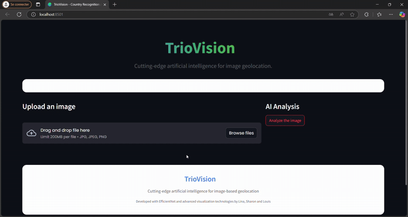

# 🌍 TrioVision

**AI-powered Image Geolocation**

TrioVision is an advanced web application that leverages deep learning to identify the country depicted in an image. Whether it's a natural landscape, a street, or a monument, TrioVision gives you the most likely country with rich visual explanations.

---

##  Features

-  EfficientNet-based classifier (PyTorch)  
-  Interactive map with animated markers (Folium + Streamlit)  
-  Visual insights: Radar charts, similarity matrices, bar plots  
-  Clean, modern UI with custom CSS and Lottie animations  
-  Real-time prediction for `.jpg`, `.jpeg`, `.png` images  

---

##  Demo

Upload an image and get country predictions with confidence levels.



---

##  Technology Stack

| Component        | Technology             |
|------------------|-------------------------|
| Frontend         | Streamlit + Custom CSS  |
| Model Inference  | PyTorch + EfficientNet-B0 |
| Preprocessing    | Torchvision             |
| Visualization    | Plotly, Folium          |
| Data Handling    | Pandas, NumPy           |

---
##  Model Details

- **Model**: EfficientNet-B0  
- **Training**: Labeled image dataset across 172 countries  
- **Output**: Top-N predictions with softmax confidence scores  

---

##  Visualizations

-  **Radar Chart**: Confidence & similarity comparison  
-  **Heatmap**: Inter-country similarity matrix  
-  **Probability Distribution**: Ranked bar plot  
-  **Interactive Map**: Pulse markers + geospatial visualization  

##  Project Structure

```bash
TrioVision/
├── src/
│   ├── app.py                # Main Streamlit app
│   ├── model.py              # Model loading & prediction
│   ├── utils.py              # Preprocessing, maps, visualizations, etc.
│   ├── config.py             # App config (paths, colors, etc.)
│   ├── styles.py             # Custom CSS injection
│   └── preprocessing.py      # Preprocessing class (image → tensor)
│
├── models/
│   └── model_ef_model_2025-04-16_12-05-34.pth    # Trained EfficientNet model
│
├── data/
│   ├── country_labels_total_essaie.json          # Country label index
│   ├── team.jpg                                  # Team photo for README
│   └── demo.gif                                  # Demo GIF for README
│
├── run.py                 # Streamlit launcher (CLI-friendly)
├── requirements.txt       # Project dependencies
└── README.md              # Full project documentation
```
##  Installation

### 1. Clone the repo

```bash
git clone https://github.com/linabnz/triovision.git
cd triovision
```

### 2. Create an environment & install dependencies
```bash
python -m venv venv
source venv\Scripts\activate
pip install -r requirements.txt
```
### 3. Launch the app
```bash
python run.py
```

---

##  Meet the Team


- **Lina Benzemma** 
- **Sharon Chemmama** 
- **Louis Lebreton** 
